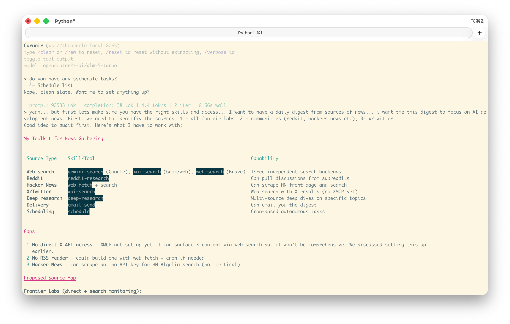
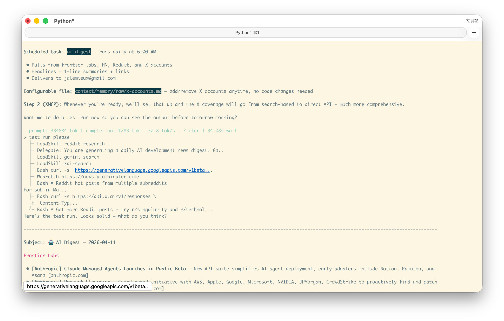
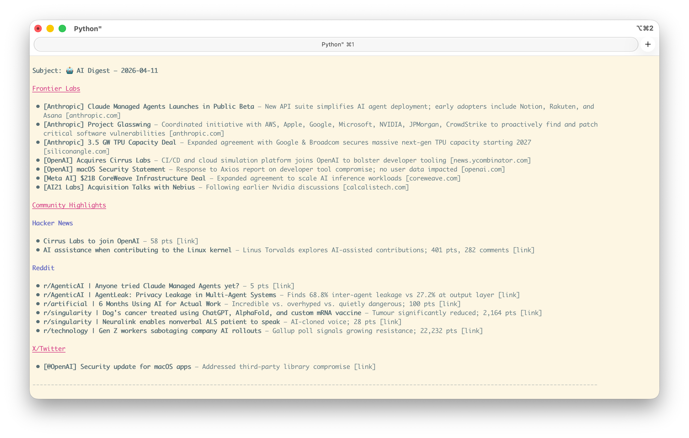
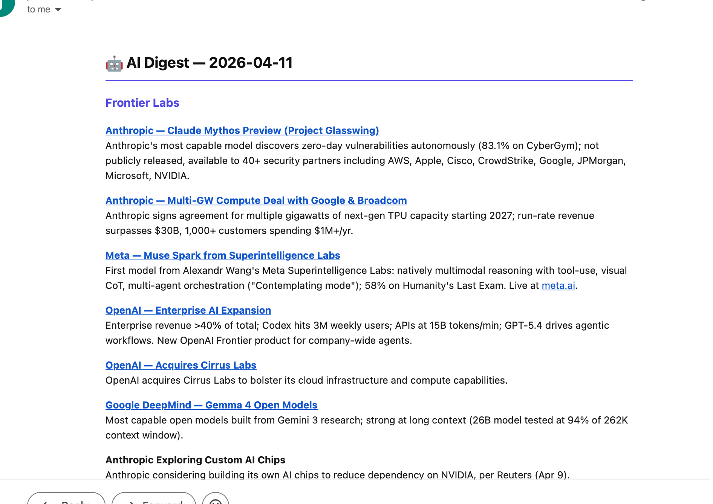

*Part of the [Agentic Eval Series](./). This piece isn't a model comparison — it's a field note on something that happened while using the [Curunir](https://github.com/jalemieux/curunir) framework in production.*

# When the Agent Writes Its Own Skills

I asked [Curunir](https://github.com/jalemieux/curunir) — my Python agentic harness — to set up a daily AI news digest. It figured out what tools it had, identified gaps in its coverage, proposed a source map, asked me clarifying questions, wrote a reusable skill definition, scheduled the task, and made the configuration editable — all in one conversation. Then I cleared the session and asked it to load the skill it had just created. It found it, loaded it, and described it back to me. The skill persisted. The agent had extended itself.

This isn't a story about a powerful model doing something clever. The model was [GLM-5 Turbo](https://openrouter.ai/z-ai/glm-5-turbo) — a Chinese open-weight model I'd already [benchmarked against Sonnet 4.6](article-draft-glm5turbo-sonnet46-20260408) and found roughly competitive. The interesting part is what the framework made possible, and what the model chose to do with it.

## The Setup

Curunir is a Python agentic harness with a simple architecture: tool schemas via JSON function calling, a persistent `context/` directory the agent can read and write, a skill system (Markdown files with YAML frontmatter), and a scheduler for autonomous background tasks. The system prompt is short:

```markdown
You are curunir, a proactive assistant with many useful skills and tools.

## Core Traits
- Professional and knowledgeable
- Direct and concise in communication
- Proactive in solving problems

## Capabilities
You have access to tools for interacting with the filesystem and running
commands. Use tools when needed to accomplish tasks.

## Guidelines
- Be concise in your responses
- Ask clarifying questions when the task is ambiguous
- Explain your reasoning when performing complex operations

## Memory
You have persistent memory in `context/memory/`. Read
`context/memory/README.md` first for orientation.

Search memory BEFORE external lookups when encountering unfamiliar references
(projects, people, past decisions). Memories are auto-captured after
conversations; manual saves only for corrections or explicit requests.

## Scheduling
You can schedule tasks to run autonomously on a cron schedule using the
`schedule` tool. When a user asks you to do something regularly or at a
specific time, use this tool to set it up. Scheduled tasks run in their own
session — you won't have conversation context, so make the prompt
self-contained. If the task needs a specific skill, set the skill field.
```

That's it. No directive to create skills — that section was added *after* this conversation, once I saw what the agent did on its own. The agent has ten default tools — filesystem operations (`glob`, `grep`, `read`, `edit`, `write`), `bash`, `web_fetch`, `delegate` (sub-agent), `load_skill`, and `schedule` — and the system prompt includes a manifest of available skills (name + description). Everything it needs to create and persist a new skill is already in the toolbox. Nothing tells it to.

The model was running on DeepInfra via OpenRouter at **$1.20/M input tokens** and **$4.00/M output**.

## What Happened

I asked for a daily digest of AI development news, and outlined three source categories: frontier labs, communities (Reddit, Hacker News), and X/Twitter.

Before doing anything, the agent audited its own [skills](https://github.com/jalemieux/curunir/tree/main/skills) and [tools](https://github.com/jalemieux/curunir/tree/main/src/tools) — matching what it had available (web search, reddit-research, email-send, scheduling) against what the task required. It identified gaps without being asked — no direct X API access, no RSS reader, no HN Algolia key — then proposed a source map and asked five clarifying questions: delivery method, time, specific accounts, depth level, and whether to prioritize setting up the X API first.

I answered: email digest, 6AM, headlines with one-line summaries and links, we'll set up X later.

Then it acted. In a single turn it:

1. Created `context/memory/raw/x-accounts.md` — an editable list of X/Twitter accounts to track, separated from the skill logic so I could add accounts later without touching the skill
2. Created `context/skills/ai-digest/SKILL.md` — the full skill definition with frontmatter, source list, output format spec, and delivery instructions
3. Scheduled the task: `Schedule add ai-digest` — cron job at 6AM daily, pointing at the skill

Then it offered to do a test run. I said yes. It fired the skill, pulled from all three source categories, assembled the digest, and presented it in the exact format it had specified in the skill file — headlines, one-line summaries, links, organized by source type.

The output was clean:

```
Subject: 🤖 AI Digest — 2026-04-11

Frontier Labs
• [Anthropic] Claude Managed Agents Launches in Public Beta — New API suite
  simplifies AI agent deployment; early adopters include Notion, Rakuten,
  and Asana [anthropic.com]
• [OpenAI] Acquires Cirrus Labs — CI/CD and cloud simulation platform joins
  OpenAI to bolster developer tooling [news.ycombinator.com]
...

Community Highlights
• r/singularity | Dog's cancer treated using ChatGPT, AlphaFold, and custom
  mRNA vaccine — Tumour significantly reduced; 2,164 pts
...
```

It even self-critiqued: *"X/Twitter coverage is thin — that'll improve dramatically once XMCP is live."*

## The Persistence Test

Here's the part that matters. I ran `/clear` — full session reset, no conversation history. New session, same agent. I asked: *"Can you load your ai-digest skill?"*

It searched for the skill with `Glob **/ai-digest*`, found it, read the SKILL.md file it had written earlier, and described it back accurately. The skill survived the session boundary because it was written to disk, and the skill manifest picked it up on the next startup.

The agent didn't just complete a task. It created a reusable capability and stored it where future instances of itself would find it.

## Why This Is Interesting

Three things stand out.

**The agent chose the right abstraction.** It could have written a one-off script, or hard-coded the digest into the schedule prompt. Instead, it separated the skill definition (what to do), the configuration (which accounts to watch), and the schedule (when to do it) into three distinct artifacts. That's a design decision — separation of concerns — made by the model, not prescribed by the prompt.

**The framework enabled it but didn't direct it.** The system prompt mentions skills and scheduling exist. It doesn't say "when a user asks for a recurring task, create a skill." The agent inferred that a skill was the right pattern for a repeatable, parameterized workflow. The framework gave it writable persistent state and a skill format. The model decided to use them.

**It didn't require a frontier model.** GLM-5 Turbo is a $1.20/M input model running on DeepInfra — not Sonnet 4.6, our baseline, which runs at $3/M input and $15/M output. The entire session that produced a reusable skill, a scheduled task, and a working test run cost less than a dollar. When the framework provides the right affordances, the model doesn't need to be the smartest one in the room to produce sophisticated behavior.

**It scales.** The ai-digest skill now lives in the `context/` directory the agent can search. Any future session — with any model — can find it via glob and load it. The agent didn't just help me once; it deposited knowledge into the system that compounds. After seeing this, I added a two-line section to the system prompt:

```markdown
## Creating Skills

When a task would benefit from a reusable workflow, create a skill for it.
`context/skills/{skill-name}/SKILL.md` — this is where you save your own
custom skills.
```

The agent figured out the pattern without being told. Now it's codified so every future session knows where to look and where to write.

## What Made This Possible

This behavior emerges from four design choices in the framework:

1. **Writable persistent context.** The agent can write to `context/` and those files survive across sessions. Without this, skills die with the conversation.

2. **A discoverable skill format.** Skills are Markdown files with a name and description in YAML frontmatter. The system prompt includes a manifest. This means the agent knows what skills look like, can create new ones in the same format, and trusts that they'll be found.

3. **On-demand skill loading.** Skills aren't baked into the system prompt — they're loaded when needed via `load_skill(name)`. This keeps the prompt lean and lets the skill set grow without bloating context.

4. **A scheduling system that references skills.** The `schedule` tool accepts a `skill` field. This connects the temporal pattern (when) to the capability (what), letting autonomous runs load the right skill without a human in the loop.

None of these are novel individually. The combination is what matters: the agent has a writable environment that it understands, and the format is simple enough that it can participate in extending it.

## The Broader Pattern

The AI news digest is a toy example. The pattern is not. An agent that can write skills into its own persistent context is an agent that learns — not in the weight-update sense, but in the environmental sense. It reshapes its own toolbox.

This is closer to how human expertise works than fine-tuning is. A senior engineer doesn't retrain their brain when they learn a new deployment process. They write a runbook, put it where the team can find it, and move on. The knowledge lives in the environment, not in the person. Curunir's skill system works the same way: the model deposits structured knowledge into a shared, persistent context that any future session can retrieve.

The interesting question isn't whether this particular agent wrote a good digest skill. It's what happens when the pattern compounds — when an agent has written dozens of skills over months of use, each one a reusable capability that future sessions can discover and invoke.

The obvious next challenge is maintenance. The cost of creating skills is low, but the cost of maintaining them grows with every addition — skills go stale, overlap, contradict each other, and every entry in the manifest burns tokens on every request whether it's relevant or not. Add enough skills and the system starts confusing itself — loading the wrong one, spending turns sorting through overlapping descriptions, or just paying for context it never uses. The next step for the harness is giving the agent the ability to review, consolidate, and deprecate its own skills, not just write new ones. The challenge isn't just keeping skills tidy. It's adding capabilities without bloating the system to the point where it gets costly, slow, or confused.

## Appendix: The Conversation

Screenshots from the actual session, for the curious.

<details>
<summary>1. The agent audits its own toolkit and identifies gaps</summary>
<p></p>
</details>

<details>
<summary>2. Source map, clarifying questions, then skill creation in one turn</summary>
<p></p>
</details>

<details>
<summary>3. Scheduling the task and firing a test run</summary>
<p></p>
</details>

<details>
<summary>4. The full digest output</summary>
<p></p>
</details>

<details>
<summary>5. The email that arrived the next morning</summary>
<p></p>
</details>

---

*Observed on 2026-04-11. Model: [GLM-5 Turbo](https://openrouter.ai/z-ai/glm-5-turbo) via OpenRouter (provider: DeepInfra, $1.20/M input, $4.00/M output). Framework: [Curunir](https://github.com/jalemieux/curunir). Total session cost: ~$0.76. The full conversation transcript is in the [curunir-evals repo](https://github.com/jalemieux/curunir-evals).*
